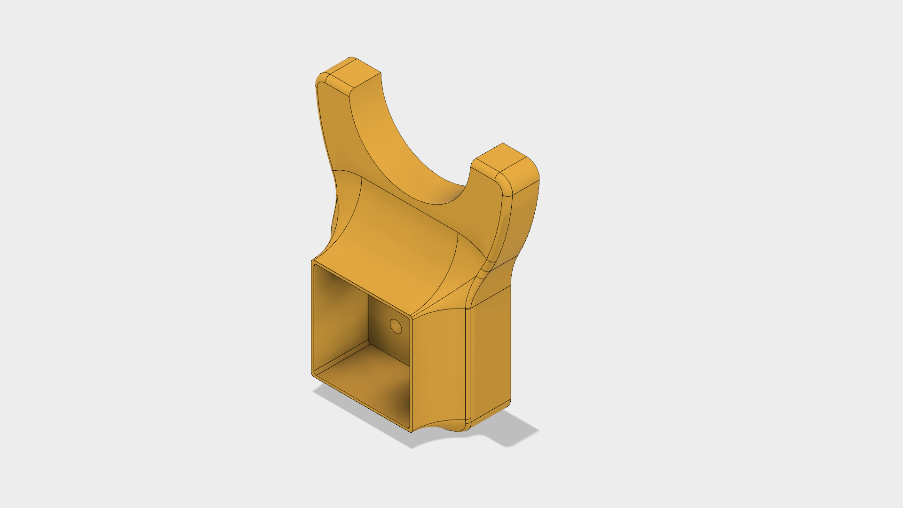
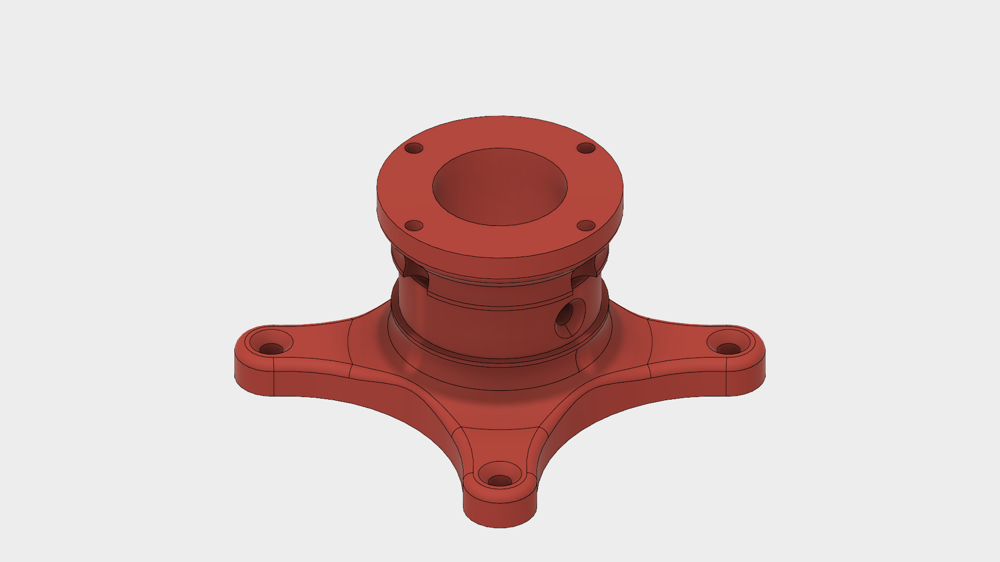
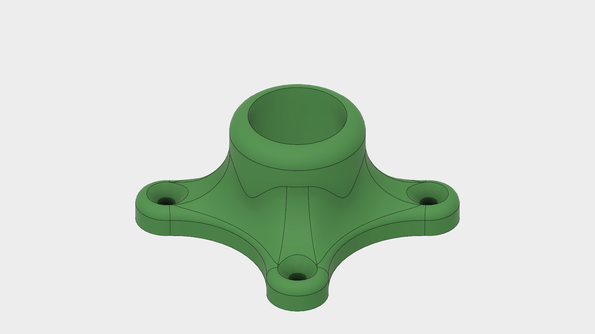
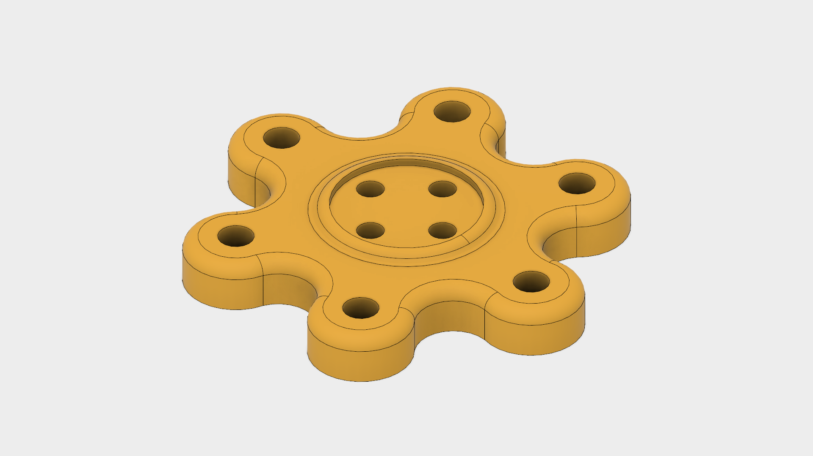
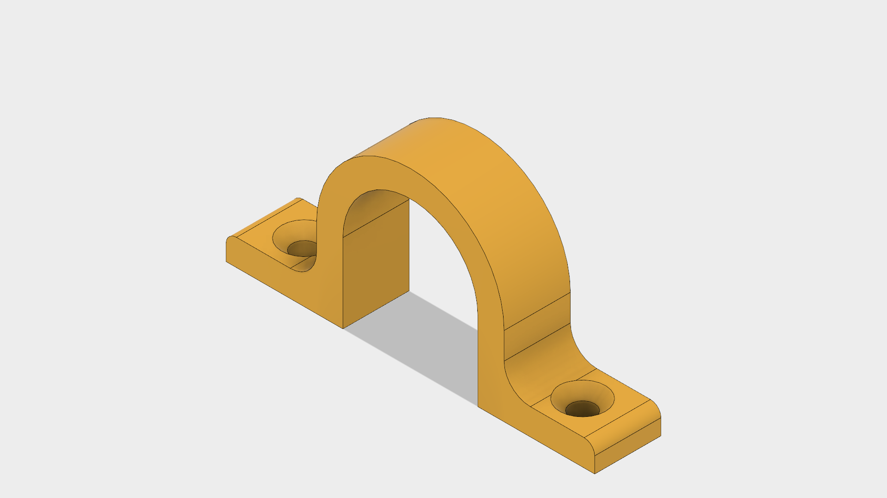
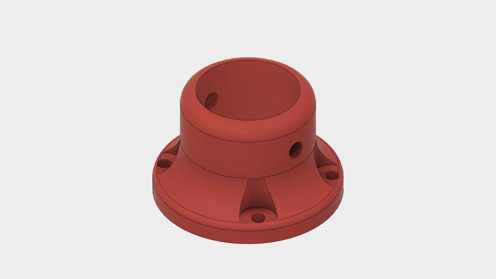
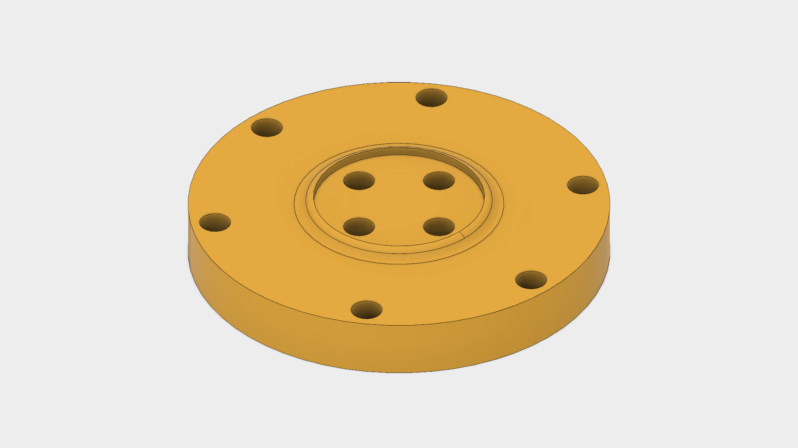

## Arduino stack standoffs
- Intended to guarantee uniform and reliable spacing between shields, reducing potential of shorts or disconnections due to tilting during use.
- Long standoffs (green) go between motor shield and audio shield.
- Short standoffs (yellow) go between audio shield and Arduino.
- Red washers go at very top of bolt.

## Axle support bracket
- Square cutout designed to loose friction fit with 2" square furring strip, which has nominal size of ~1.5".
- Circular cutout is made to fit half of a 1.5" diameter PVC tubing, cut to 1/2" in width. Use epoxy to join. This PVC inset will make direct contact with recessed ridge in "Compound pulley flange" allowing for smooth rotation and (hopefully) less friction.

## Compound pulley flange
- One side (side with four arms) mounts to back of painting or piece to spin.
- Other side fits a 14t bicycle gear with particular hole pattern using M3 bolts.
   - Hole pattern is rotated to make it easier for a screwdriver to reach bolt heads for tightening / racheting.
- Includes a 1/2" wide recessed ridge meant to guide rotation of entire component along PVC inset on "Axle support bracket"
- A 1" wooden dowel goes through center hole, optionally fastened with small wood screw within recessed ridge. Make sure the head of the screw stays below diameter of this ridge to avoid interfering with rotation.

## Flange (right angle)
- Center hole has clearance fit allowance in order for 1" wood dowel to spin freely.
- Only meant to constrain wood dowel during rotation.

## Large pulley (26t) to Universal Mounting Hub adapter
- Allows for mounting of a 26t with a particular hole pattern to a Universal Mounting Hub from Pololu.
- Uses M4 bolts (with washers and lock nuts) to connect adapter to pulley.
- Uses M3 bolts (with lock nuts under adapter) to connect adapter to Universal Mounting Hub.

## Motor clamp
- Snuggly fits around gearmotor to help hold it in place. Use two wood screws to get desired level of tension.
- I recommend only using one directly over the gearbox, NOT the motor, to allow for better heat dissipation.

## Small pulley (14t) flange
- Center hole fits 1" wood dowel.
- Meant to be bolted onto 14t bicycle gear with a particular hole pattern.
- Meant to accommodate M3 lock nuts with enough clearance to allow for a ratchet for easier tightening.

## Small pulley (14t) to Universal Mounting Hub adapter
- Uses M3 bolts for all holes.
- Allows for use of drive pulley matching output pulley for better torque (at lower speed).

