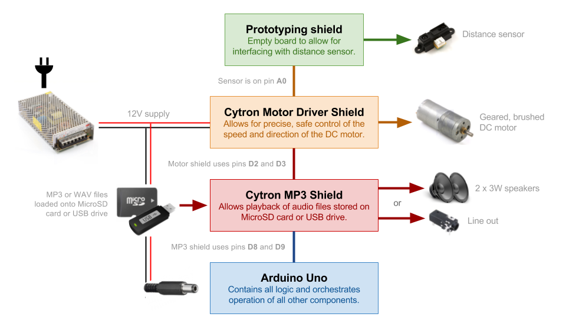
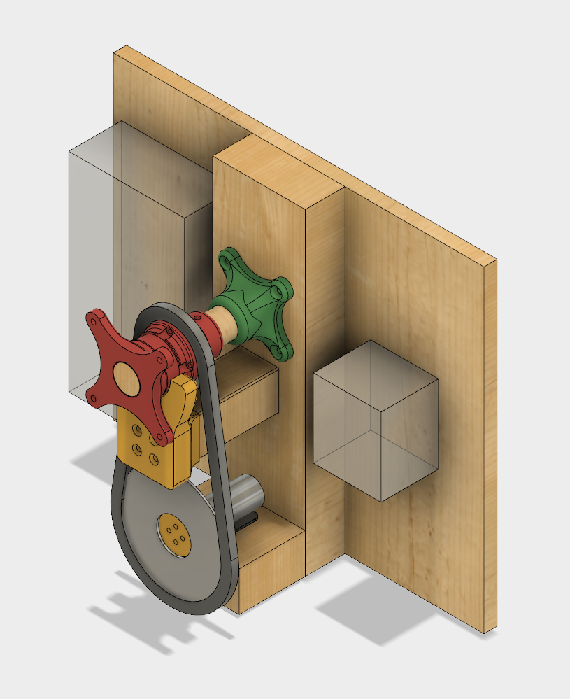

# PaintingSpinner
Arduino-based hardware platform for interactively spinning a painting using a DC motor, infrared rangefinder and custom 3D printed components.

## Components

- Arduino Uno R3
- A [99:1, 300oz-in gearmotor](https://www.pololu.com/product/3207) driven by a [Cytron 10A DC Motor Driver Shield](http://www.robotshop.com/en/10a-dc-motor-driver-arduino-shield.html)
- Two 3W speakers driven by a [Cytron Easy MP3 Shield](http://www.robotshop.com/en/cytron-easy-mp3-shield.html)
- A [Sharp 2Y0A02 distance sensor](https://www.sparkfun.com/products/8958)
- Salvaged bicycle parts (chain, 26t and 14t gears)
- Various sizes of [scrap wood](https://github.com/jasonwebb/PaintingSpinner/blob/master/BOMs/Wood%20cutlist.csv)
- Various custom [3D printed parts](https://github.com/jasonwebb/PaintingSpinner/tree/master/CAD) designed in Fusion 360
- Various wood screws and angle brackets

## Electronics architecture

## Mechanical assembly

